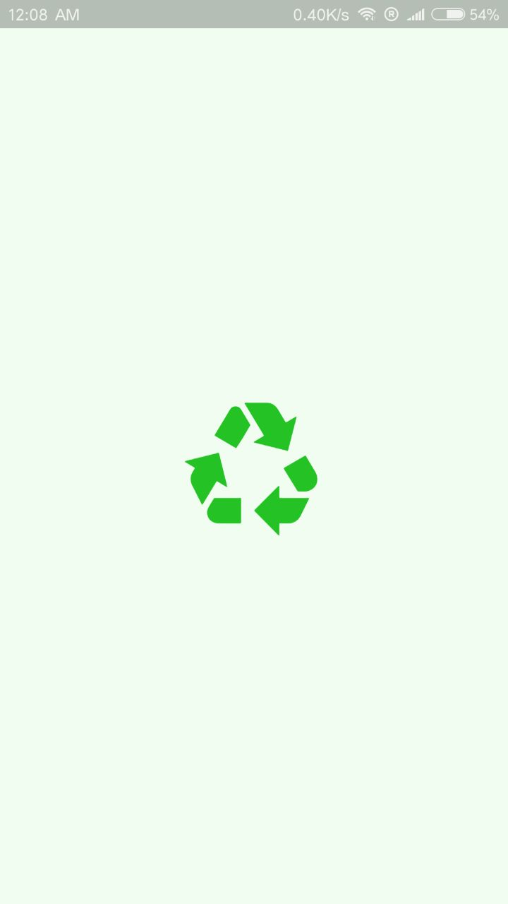
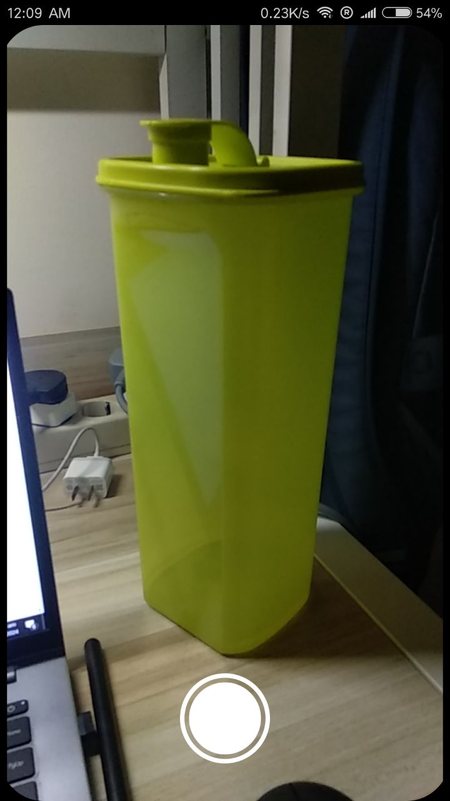
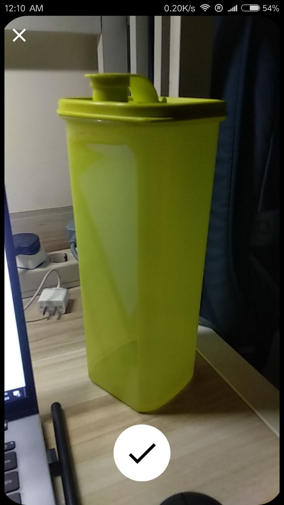
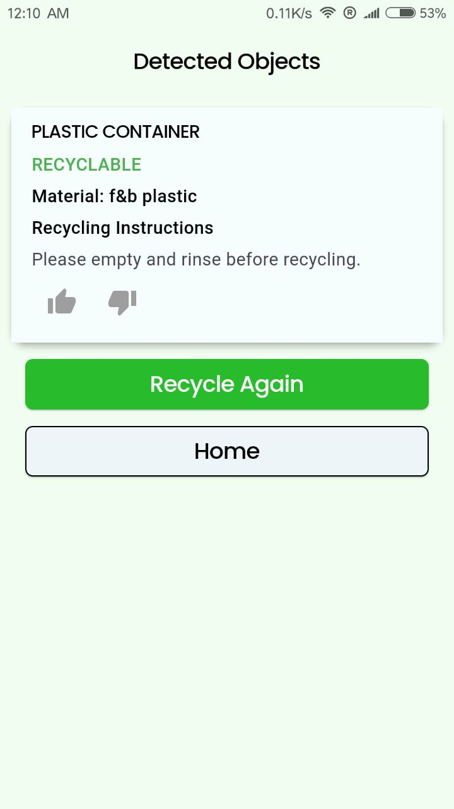

<!-- Improved compatibility of back to top link: See: https://github.com/othneildrew/Best-README-Template/pull/73 -->
<a name="readme-top" id="readme-top"></a>

<!-- TABLE OF CONTENTS -->
<details>
  <summary>Table of Contents</summary>
  <ol>
    <li>
      <a href="#about-the-project">About the Project</a>
      <ul>
        <li><a href="#built-with">Built With</a></li>
      </ul>
    </li>
    <li>
      <a href="#getting-started">Getting Started</a>
      <ul>
        <li><a href="#prerequisites">Prerequisites</a></li>
        <li><a href="#installation">Installation</a></li>
        <li><a href="#run-the-app">Run the App</a></li>
      </ul>
    </li>
    <li>
      <a href="#screenshots-of-the-app">Screenshots of the app</a>
    </li>
  </ol>
</details>


<!-- ABOUT THE PROJECT -->
## About the Project
The application aims to make recycling and waste disposal more accessible and accurate for everyone. Users can capture images of items using the app, which will then analyze and detect the objects within the images. The app will classify each detected item based on the NEA's (National Environment Agency) waste list, determining whether it is recyclable or not. Additionally, it provides users with specific disposal instructions, ensuring proper and environmentally friendly waste management practices. 


### Built With

* [![Dart][Dart.com]][Dart-url]
* [![Flutter][Flutter.com]][Flutter-url]
* [![Firebase][firebase.com]][firebase-url]


<!-- GETTING STARTED -->
## Getting Started
### Prerequisites
1. Create a Firebase project
2. Add Firebase to Android application
3. [Android Studio] installed
4. Create an emulator in Android Studio

### Installation
1. Clone the repo
   ```sh
   git clone https://github.com/StanfordDC/bloo_app.git
   ```

### Run the App
1. Replace variable in curly braces in main.dart file with your own credentials.
    ```sh
      apiKey: {Firebase api key},
      authDomain: {Firebase auth domain},
      databaseURL: {Firebase database url},
      projectId: {Firebase project id},
      storageBucket: {Firebase storage bucket},
      messagingSenderId: {Firebase sender id},
      appId: {Firebase app id}
    ```
    The credentials can be found on Firebase project console Project Settings > General > Your Apps > Web App

2. Change directory to root
   ```sh
   cd bloo_app
   ```
   
3. Run the app
   ```sh
   flutter run
   ```

<!-- SCREENSHOT OF THE APP -->
## Screenshots of the App
1. Home


2. Capture Image


3. Confirm Image


4. Detected items


<p align="right">(<a href="#readme-top">back to top</a>)</p>


[Flutter-url]: https://flutter.dev/
[Flutter.com]: https://img.shields.io/badge/Flutter%20-%2302569B.svg?&style=for-the-badge&logo=Flutter&logoColor=white
[Dart-url]: https://dart.dev/
[Dart.com]: https://img.shields.io/badge/dart-%230175C2.svg?&style=for-the-badge&logo=dart&logoColor=white
[firebase-url]: https://firebase.google.com/
[firebase.com]: https://img.shields.io/badge/firebase-black?style=for-the-badge&logo=firebase&logoColor=color
[Android Studio]: https://developer.android.com/studio
